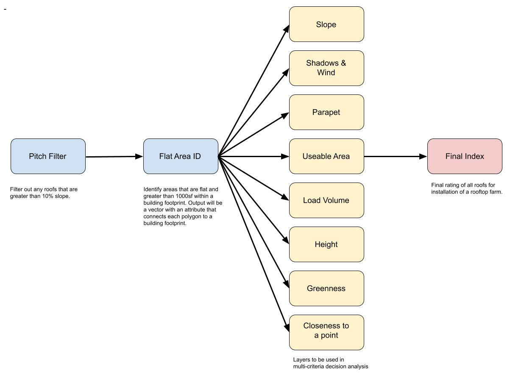

# Dirtsat Rooftop Index Development

## Dependencies
- Python 3 and Jupyter Notebooks
- All other python dependencies are listed in the `requirements.txt` file
- Make sure the `pygdal` version matches the `gdal` version on your local machine. 
- To run the index, AWS CLI S3 bucket access is needed. 
    - Alternatively, the code can be run on the DirtSat EC2 instance that is linked to the S3 buckets.

## Installation
- This is a Python package that must be installed to run the index for a given location.
- To install the package, clone the repository: `git clone https://github.com/DirtSatHQ/rooftop-index.git`
- Navigate to the cloned directory: `cd /path/to/rooftop-index`
- Install with pip: `pip install .`

## Conceptual diagram

## Concept details

### Pitch Filter
[Pitch filter POC notebook](poc/roof_pitch/lidar_roof_pitch.ipynb)

Based on LiDAR data. Filter out any roofs that are not flat. 

First, LiDAR elevation data is converted to slope using the gdal.DEMProcessing module. A rooftop is classified as flat if the number of pixels on a given rooftop that are less than or equal to **slope_threshold** make up more than **area_threshold** percent of the rooftop. **slope_threshold** is a hyperparameter defining the slope (in degrees) at which we consider a pixel to be flat. **area_threshold** is a hyperparameter defining the percentage of pixels on a rooftop that must be flat for a roof to be considered flat. 

### Flat Area ID (FAID)
[FAID POC notebook](poc/useable_area/flat_area.ipynb)

Based on LiDAR data. Identify areas within building footprint that are flat and greater than 1000 sf. Output is a shapefile with an attribute that connects each polygon to a building footprint. 

This vector data will be used to throughout the MCDA feature development. 

To find contiguous flat areas, a raster of building height is smoothed with a gaussian filter to remove any pits, and a raster of slope is masked to 1 if slope is less than 45 degrees and 0 if slope is greater than 45 degrees. These two new rasters are multiplied and filtered to remove pixels that are smaller than 5 feet. The raster is then polygonized using GDAL and intersected with the building footprint vector to create a vector of contiguous flat areas within building footprints. Finally, this new vector is filtered to remove flat areas smaller than 1000 square feet. 

### Useable area
[Useable area POC notebook](poc/useable_area/flat_area.ipynb)

Based on LiDAR data. The area within a FAID that could be used to for a farm. 

Useable area is derived from each unique FAID. For a given FAID polygon, the area attribute is extracted from the .shp geometry and multiplied by 10.7639 to convert from m^2 to ft^2.

### Slope
Based on LiDAR data. The average slope within a FAID.

### Load volume
[Load volume POC notebook](poc/load_capacity/load_capacity.ipynb)

Load volume is created from the FAID and building footprint data. First, the inverse of the flat area is found by performing a spatial difference between the FAID and each building footprint. The height and area of each of the resulting polygons is then calculated and multiplied as an estimate of volume (assumes that all objects on rooftop are rectangular). Finally, the volume of all objects on a given building is summed, giving a total estimate of volume on a rooftop.

### Building height
[Height POC notebook](poc/roof_height/roof_height.ipynb)

Based on LiDAR data. The average height above ground surface of FAID.

This is calculated from a raster of structure height. If there is no height raster you can calculate it from subtracting the DSM from the HFDEM. For example, see this [notebook](roof_height/caculate_height_raster.ipynb).  

### Greenness
Based on Sentinel data. Greenness of the rooftop. 

### Closeness to a point
[Closeness to a point POC notebook](poc/closeness_to_point/closeness_to_point.ipynb)

Based on FAID and point data in vector format. 

For a given FAID and a vector of points, this function finds the minimum distance to a point from the centroid of the FAID.

### Shadows and wind
Not yet implemented.

### Parapet
[Parapet detection POC notebook](poc/parapets/parapet_detection.ipynb)

To detect parapets, a one meter buffer is placed inside each of the building footprints. For each buffer, the average slope is calculated. A higher average slope suggests that a parapet might be present. 

### Final index
Based on a multi-criteria decision analysis (MCDA) from the 8 features described above. FAIDs that have optimal values for all of the above features will have a high rank, while FAIDs with sub-optimal values for all features will have a low rank. FAIDs with the highest rank are considered the best rooftops for urban greenspaces. For this process we use the Scikit-Criteria package that was made for performing MCDA analysis.

## Algorithm

1. Create geotiffs (e.g. height and slope)

2. Create building footprints as vector data if they are not already available.

3. Filter out roofs that are not relatively flat

4. Disaggregate rooftops into flat areas and create vector data file

5. Using diaggregated flat areas, calculate specified features for each area.

6. Using the disaggregated flat areas vector file with all features added, calculate index using multi-criteria decision analysis.  
